# A Complete Guide to Aging Fish
- [A Complete Guide to Aging Fish](#a-complete-guide-to-aging-fish)
  - [An Introduction Into Aging Fish](#an-introduction-into-aging-fish)
  - [The Science Of Aging Fish](#the-science-of-aging-fish)
    - [Adenosine Triphosphate (ATP) and energy production](#adenosine-triphosphate-atp-and-energy-production)
    - [The chemistry of fish rigor mortis](#the-chemistry-of-fish-rigor-mortis)
    - [How does rigor mortis affect the flavor of fish?](#how-does-rigor-mortis-affect-the-flavor-of-fish)
    - [Aging fish](#aging-fish)
      - [ATP 分解](#atp-分解)
      - [蛋白質分解](#蛋白質分解)
        - [組織蛋白酶](#組織蛋白酶)
        - [鈣蛋白酶](#鈣蛋白酶)
        - [膠原蛋白酶](#膠原蛋白酶)
      - [細菌分解](#細菌分解)
        - [活魚的菌相](#活魚的菌相)
        - [微生物的侵入](#微生物的侵入)
        - [貯藏及腐敗期間微生物菌群的變化∕特定的腐敗微生物](#貯藏及腐敗期間微生物菌群的變化特定的腐敗微生物)
        - [貯藏與腐敗過程中細菌生長所誘發的生化變化](#貯藏與腐敗過程中細菌生長所誘發的生化變化)
        - [氧化三甲胺(TMAO)的還原](#氧化三甲胺tmao的還原)
        - [常見的腐敗化合物](#常見的腐敗化合物)
        - [常見的不良氣味/不良風味化合物與其基質](#常見的不良氣味不良風味化合物與其基質)
      - [脂質降解](#脂質降解)
  - [Food Science](#food-science)
    - [Flavor](#flavor)
      - [Umami](#umami)
    - [Smell](#smell)
      - [Bad Smell](#bad-smell)

Ref: [A Complete Guide to Aging Fish](https://thejapanesefoodlab.com/a-complete-guide-to-aging-fish/)

- Aging fish has gained popularity due to its alignment with modern progressive food culture, emphasizing sustainability and zero waste cooking.
- The article offers a unique perspective on the social aspect of aging fish, differing from mainstream media narratives.
- It provides comprehensive information on aging fish, covering science, preparation techniques, suitable fish types, and safety precautions.
- Emphasizes the distinction between wet aging and dry aging fish, drawing from the author's experience in a high-end Japanese sushi restaurant.

## An Introduction Into Aging Fish
Ref: [An Introduction Into Aging Fish](https://thejapanesefoodlab.com/aging-fish-intro/)

- Dry aging fish is akin to beef aging, aiming to improve texture and flavor over 7 to 90 days in a controlled environment.
- Wet aging, primarily in Japan, involves sealing gutted fish in plastic bags for 3 to 10 days, maintaining moisture levels for texture enhancement. (Any excess moisture released by the fish is unable to escape, and thus the fish ages at almost 100% humidity, regardless of fridge humidity. This means that any exposed flesh does not dry out, and the skin of the fish remains moist.)
- Dry aging leads to moisture loss, concentrating flavors and allowing the skin to dry for easier crisping during cooking.
- Dry aging requires precise temperature and humidity control, often inaccessible for home enthusiasts due to cost and complexity.
- Proponents of dry aging emphasize the importance of sourcing fresh fish and using specific dispatch methods, like ikejime, for optimal results.

Here's a table in markdown format comparing dry and wet aging fish based on the key points:

| Key Points              | Dry Aging                                                  | Wet Aging                                                              |
|-------------------------|------------------------------------------------------------|------------------------------------------------------------------------|
| Process                 | Hanging gutted fish in a specialized fridge for 7 to 90 days | Sealing gutted fish in plastic bags in a fridge for 3 to 10 days      |
| Moisture Content        | Results in moisture loss, leading to concentrated flavor   | Preserves moisture, resulting in less flavor concentration             |
| Flavor Development      | Allows for pronounced flavor development over time          | Results in less pronounced flavor development due to preserved moisture |
| Texture                 | Enhances texture through enzymatic activity                | Improves texture through enzymatic activity, retains moisture          |
| Equipment and Environment | Requires specialized fridge with precise control          | Can be done in a regular fridge, simpler equipment requirements        |

## The Science Of Aging Fish
Ref: [The Science Of Aging Fish](https://thejapanesefoodlab.com/aging-fish-science/)  

### Adenosine Triphosphate (ATP) and energy production
Ref:
1. [2-2細胞的能量來源 呼吸作用_1有氧呼吸](https://www.youtube.com/watch?v=RDsAnaMf8a8&ab_channel=%E5%85%AC%E9%B4%BF%E7%94%9F%E7%89%A9%E5%B0%8F%E8%AC%9B%E5%A0%82)
2. [維持生命的能源 -- ATP 從哪裡來？](https://www.chachanuts.com.tw/article_detail/46)
3. [能量的來源](https://www.youtube.com/watch?v=XRnweLV1aas&ab_channel=%E7%BF%B0%E6%9E%97%E9%9B%B2%E7%AB%AF%E5%AD%B8%E9%99%A2eHanlin)  
4. [Quality and quality changes in fresh fish](https://www.fao.org/3/v7180e/V7180E00.htm#Contents)
5. [魚貝類的化學組成與其死後變化](https://fs.ntou.edu.tw/var/file/73/1073/attach/36/pta_28166_7336578_66272.pdf)
6. [運動時的三大能量系統](https://www.dietitianbread.com/nutritionindailylife/sportnutrition/%E9%81%8B%E5%8B%95%E6%99%82%E7%9A%84%E8%83%BD%E9%87%8F%E4%BE%86%E6%BA%90%E6%98%AF%E4%BB%80%E9%BA%BC%EF%BC%9F/)

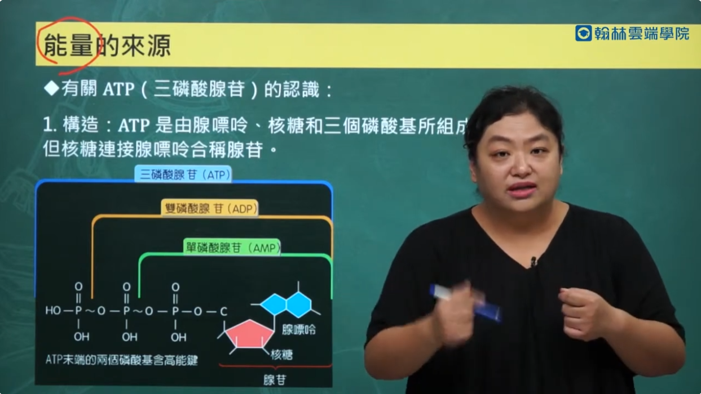
- 核糖: 5碳 + 1氧，稱5碳糖
- 腺苷: 核糖的其中一個C利用核苷鍵連接著腺嘌呤，其全名為腺嘌呤核糖核苷
- 單磷酸腺苷(AMP): 腺苷接著一個磷酸根
- 雙磷酸腺苷(ADP): 腺苷接著兩個磷酸根
- 三磷酸腺苷(ATP): 腺苷接著三個磷酸根

When energy is needed during swimming, ATP is then able to bind to the fish’s muscles before breaking down into Adenosine Diphosphate (ADP) and phosphate, in the process releasing energy that is then used to power its muscle contractions. 

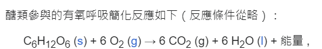  
透過有氧呼吸，可以在粒線體內將葡萄糖與氧氣轉化成二氧化碳、水與ATP
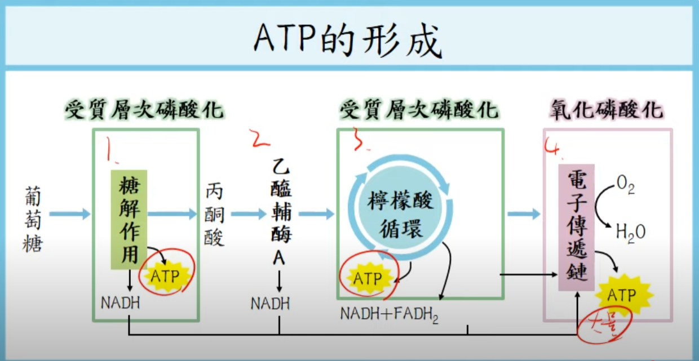  
實際上的作用更為複雜，有多個反應都可以產生ATP  
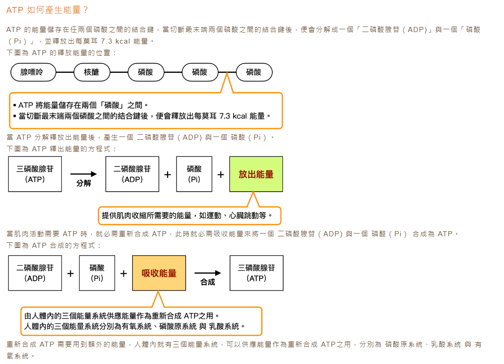  
而ATP轉換成能量，就是利用磷酸根的轉移  

上述反應的前提是氧氣的供應，故稱有氧呼吸，或稱好養代謝(aerobic metabolism)  
在氧氣充足的條件下，葡萄糖(透過肝醣轉換而來，或由血糖(血液裡的葡萄糖)而來)、脂肪、蛋白質都可以參與反應，提供乙醯輔酶A來產生ATP
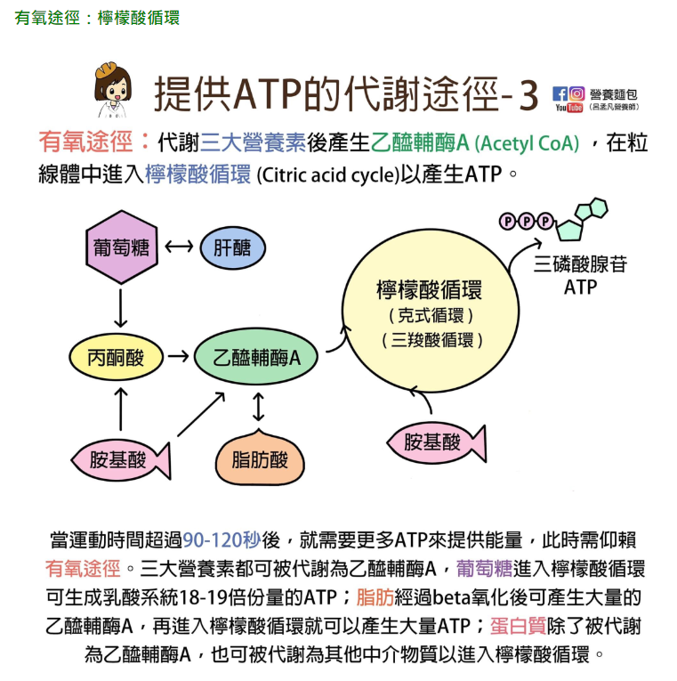  
在魚體大量運動時，或者魚體死後，讓氧氣來不及供應，或者沒有氧氣供應時，會切換成無氧發酵作用，或稱厭氧代謝(anaerobic metabolism)。  
這時有兩種途徑，一種是透過ATP-PC系統，分解磷酸肌酸來產生ATP(效率高，但量少)  
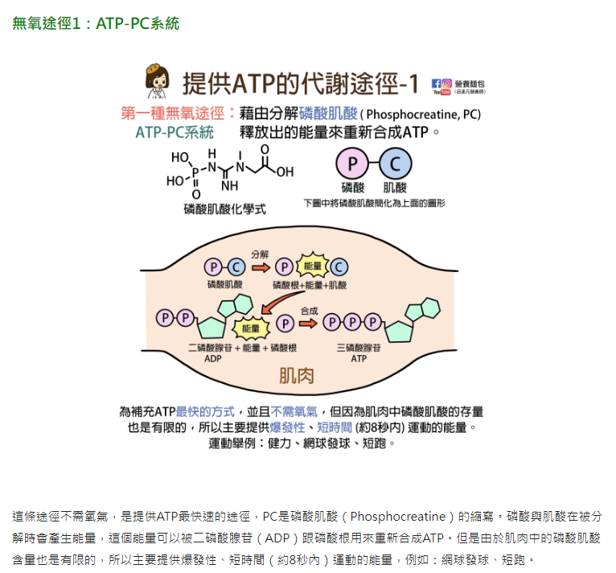  
另一種是透過[糖解(glycolysis)](https://zh.wikipedia.org/zh-tw/%E7%B3%96%E9%85%B5%E8%A7%A3)作用，分解葡萄糖來產生ATP(效率次高)  
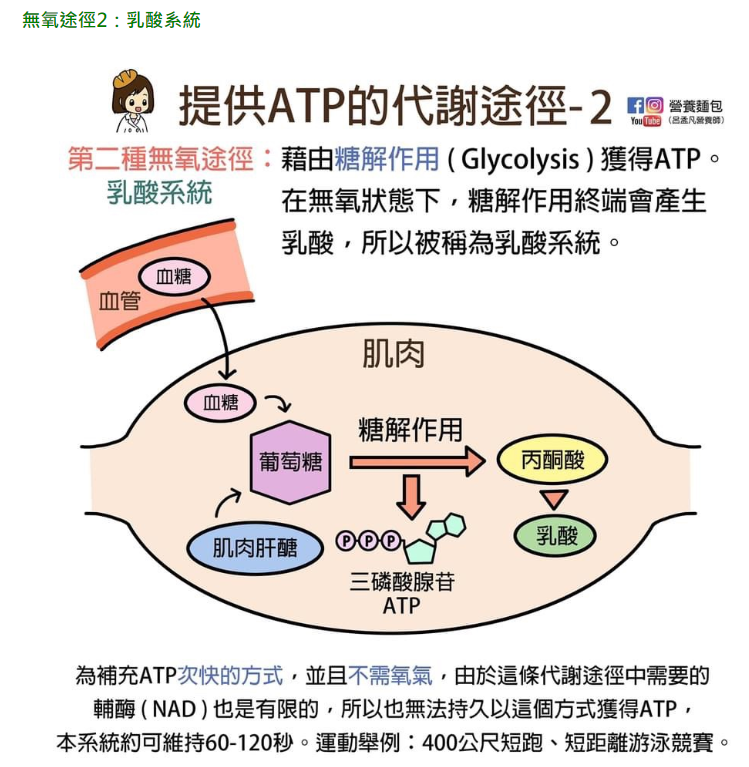  

下圖是針對硬骨魚與頭足類的分析圖，流程基本上與人類一樣  
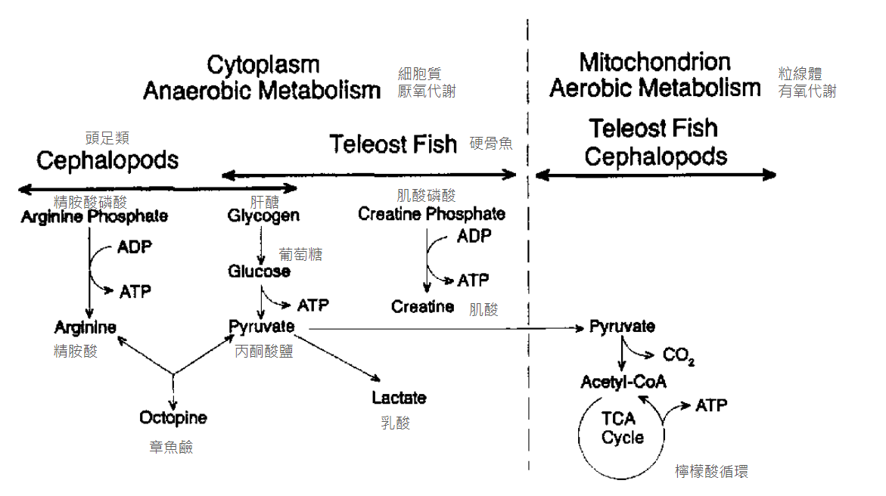  

對大多數硬骨魚類而言，一旦心臟停止跳動，便會進入無氧代謝，這效率更低的過程其最終產物以乳酸與丙酮酸為主，而乳酸與肌酸的堆積與會造成肌肉內的PH質在死後持續下降。

注意: 無氧呼吸不等於無氧發酵作用
- 無氧呼吸: 反應步驟與有氧呼吸相同，只差在最後一步，電子傳遞鏈的最後接收者不是O2，而是二氧化碳、磷酸根等其他物質。常見於厭氧微生物(生活在無氧環境中的原核生物)。
- (無氧)發酵作用: 反應步驟只有兩階段，糖解作用(產生ATP)與丙酮酸分解(不產生ATP)，下方兩種發酵方式只差在丙酮酸分解方式不同，使得產物也不同，而糖解作用是相同的
  - 酒精發酵: 在植物細胞中或有酵母菌的場合，會將丙酮酸分解為酒精與CO2
  - 乳酸發酵: 在人類骨骼肌細胞中或有乳酸菌的場合，會將丙酮酸分解(還原)為乳酸  

(見[無氧呼吸章節](https://www.phyworld.idv.tw/BA_BIO/REV/REV/1-4_POINT_(106)_OK.pdf))

註: 由此可知，**生物體內的無氧代謝指的是乳酸發酵**，產生少量ATP與乳酸。不過有趣的是，人死後微生物可進入血液中利用血糖進行酒精發酵產生乙醇，導致血中乙醇濃度升高。造成未喝酒的人，法醫卻誤判生前飲酒。([文獻](https://www.airitilibrary.com/Article/Detail/U0001-2306201115413300))

### The chemistry of fish rigor mortis
Ref:
1. [運動，從了解自己開始（肌肉滑動篇)](https://www.sportsv.net/articles/37873)
2. [肌肉收縮的機制 (Mechanism of muscle contraction)](https://www.youtube.com/watch?v=uyZFOAxJGM0&ab_channel=GYMEFIT)
3. [給健身愛好者的肌肉生理學：肌肉收縮原理＆訓練應用](https://vintraining.medium.com/%E7%B5%A6%E5%81%A5%E8%BA%AB%E6%84%9B%E5%A5%BD%E8%80%85%E7%9A%84%E8%82%8C%E8%82%89%E7%94%9F%E7%90%86%E5%AD%B8-%E8%82%8C%E8%82%89%E6%94%B6%E7%B8%AE%E5%8E%9F%E7%90%86-%E8%A8%93%E7%B7%B4%E6%87%89%E7%94%A8-ec9aaa506e44)
4. [Rigor mortis](https://en.wikipedia.org/wiki/Rigor_mortis)
5. [Rigor Mortis and Muscle Contraction](https://www.youtube.com/watch?v=MZLADPduKWw&ab_channel=DrMatt%26DrMike)
6. [肌纖維(myofibril)外環](https://smallcollation.blogspot.com/2013/04/myofibril.html#gsc.tab=0)
7. [Muscle Contraction and Locomotion - ATP and Muscle Contraction](https://bio.libretexts.org/Bookshelves/Introductory_and_General_Biology/Book%3A_General_Biology_(Boundless)/38%3A_The_Musculoskeletal_System/38.17%3A_Muscle_Contraction_and_Locomotion_-_ATP_and_Muscle_Contraction)
8. [What is ATP's role in muscle contraction?](https://www.quora.com/What-is-ATPs-role-in-muscle-contraction)
9. [魚貝類的化學組成與其死後變化](https://fs.ntou.edu.tw/var/file/73/1073/attach/36/pta_28166_7336578_66272.pdf)

rigor mortis一般翻譯為屍僵，或稱死後僵直  
在了解rigor mortis之前，需要先理解肌肉如何運動的  
名詞解釋:
1. 骨骼肌(skeletal muscle)由肌束(muscle fiber bundle)組成
2. 一束肌束由多條肌肉纖維(muscle fiber)組成，一條肌肉纖維也是一個肌肉細胞
3. 一個肌肉細胞有多個細胞核，且內含多條肌原纖維(myofibril)
4. 一條肌原纖維有多個肌小節(sarcomere)，是肌肉收縮的最小單位
5. 一個肌小節內，由肌凝蛋白(myosin)與肌動蛋白(actin)交互組成
6. 肌膜（sarcolemma）：肌細胞的細胞膜，膜上有電壓控制型離子通道，能夠傳遞動作電位
7. 肌漿質網/肌質網（sarcoplasmic reticulum）：肌細胞的內質網，滿布肌纖維的外圍，內含大量的鈣
離子。骨骼肌收縮的主要鈣離子來源
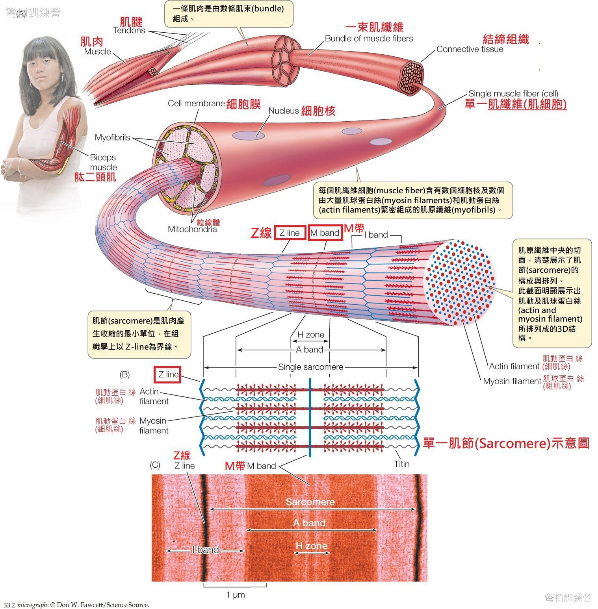  
   

肌肉收縮的步驟:
1. 大腦傳遞訊號，透過脊隨傳遞到下運動神經元，於神經元末梢的乙醯膽鹼擴散到肌肉細胞的運動終版
2. 這時鉀離子離開肌肉細胞、鈉離子進入肌肉細胞，透過鉀鈉離子產生的動作電位，訊號會傳遞到肌漿質網的鈣離子通道，使鈣離子通道打開
3. 肌質網內的鈣離子擴散至肌原纖維時，鈣離子會與肌動蛋白上的某種蛋白質結合，使肌動蛋白的連接點(binding site)露出來
4. 肌凝蛋白的頭部區域(myosin head)這時會利用ATP磷酸鍵結中儲存的能量(並產生ADP與磷酸根)，改變角度，使頭部區域翹起(“cocked” position)，與肌動蛋白連接起來，形成橫橋(cross bridge)，ADP與磷酸根此時還連接在肌凝蛋白上
5. 肌凝蛋白產生動力滑動(power stroke)，將肌動蛋白往肌節中間拉近，ADP與磷酸根此時釋出
6. 新的ATP這時進來與肌凝蛋白的頭部區域連接，使橫橋斷開
7. 當ATP釋放能量，變成ADP與P，此時ADP與P依然連接在頭部區域，回到步驟4
8. 因此充足的ATP可以讓橫橋周期不斷進行，最終達到肌肉收縮的目的

肌肉放鬆的步驟:
1. 大腦停止傳遞訊號，因為訊號斷開，鈣離子通道關閉
2. 細胞質內的鈣離子藉由肌漿質網上的鈣幫浦主動的回收，使細胞質內鈣離子的濃度下降
3. 肌動蛋白上的鈣離子也會被回收，橫橋周期停止，肌肉因此舒張(放鬆)

重點: 充足的ATP與鈣離子是肌肉運動的關鍵。反之，**當ATP缺乏時，魚肉便會進入僵直期**。

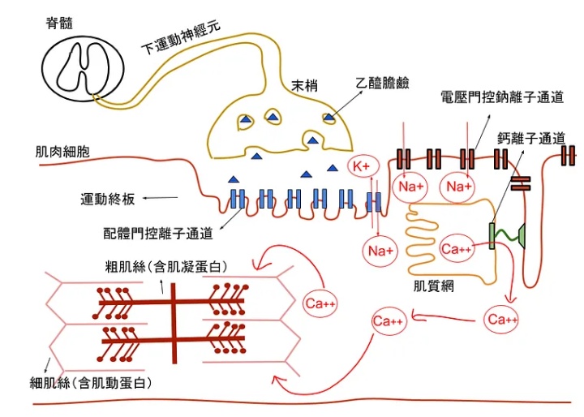 
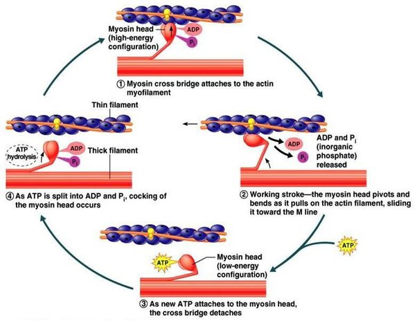 

死後僵直的過程:
1. 死後，肌膜與肌漿質網逐漸崩解，鈣離子大量釋出
2. 透過前述關於肌肉收縮的說明可知，肌凝蛋白接收到鈣離子後會觸發一系列的反應，導致肌肉收縮
3. 死後不會再繼續產生ATP，因此當ATP耗盡後，沒有新的ATP與肌凝蛋白的頭部區域連接，橫橋斷開這個步驟無法進行，導致肌肉持續處於收縮狀態，造成僵直

在一定時間後，因為體內的蛋白水解酶的作用(或是細菌)，將肌肉細胞分解，這時肌凝蛋白的頭部區域自然也不復存在，肌肉的便不會再收縮。

死後僵直的發生與消失的速率因魚種而異，溫度、處置方式、大小與魚的物理狀態等也有影響。  
一般認為死後僵直的發生與時間是在高溫下較快速，但另特別觀察熱帶魚種，卻顯示溫度對於僵直發生的影響剛好相反，這些魚種在 0℃比在 10℃更快速發生僵直。  
例如，鯉魚(Cyprinus carpio)死後僵直的發生取決於原棲息的水域溫度和貯藏溫度，當兩者的溫度差大時從死亡至僵直發生之時間就短，反之溫度差小時發生的時間就長。  
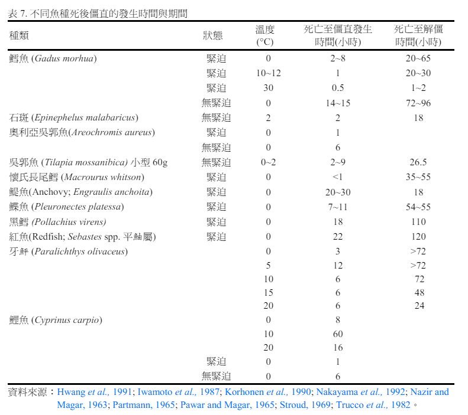

### How does rigor mortis affect the flavor of fish?
Ref:
1. [魚貝類肌肉死後及貯藏中的變化](https://fs.ntou.edu.tw/var/file/73/1073/attach/36/pta_34710_1202190_05595.pdf)
2. [魚貝類的化學組成與其死後變化](https://fs.ntou.edu.tw/var/file/73/1073/attach/36/pta_28166_7336578_66272.pdf)
3. [第六章動物原料死後之變化與低溫關係](https://www2.nkust.edu.tw/~ikuojm/file2/1-6.pdf)
4. [科學教你挑好魚](https://cirn.moe.edu.tw/BOOK/UpLoad/eBook/1889/1889.pdf)

In order to understand the effect of rigor mortis to the flavor of fish, we need to understand the chemical reaction within the fish after it dies.  
動物死後的三個階段: 
1. 死後僵直(rigor mortis)
2. 自家消化 (autolysis, aka self-digestion)
3. 腐敗(putrefaction)
(僵直解除過程中，肌肉的軟化和自家消化的變化是平行發生)

動物死後對於肌肉最直接的影響就是缺乏氧氣，肌肉細胞進入厭氧代謝反應(參考上述關於ATP的章節)。醣解(glycolysis)作用讓肝糖持續消耗，最終產物乳酸(與丙酮酸、磷酸、肌酸)的堆積造成PH質下降  
雖然說肝糖還是有產生ATP，但量很低，每莫耳葡萄糖的氧化僅產生2莫耳ATP，是有氧呼吸時的1/18倍，造成肌肉無法維持正常的ATP濃度，使的肌肉進入僵直期(參考上述關於死後僵直的章節)  
回到乳酸堆積，低PH質的魚肉其肉質會變酸，影響味道。
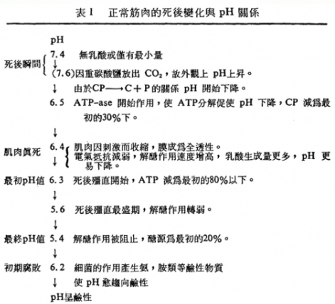  
註:CP為肌酸磷酸(Creatine Phosphate)

簡單來說，死後僵直的判斷標準:
1. CP的消失
2. ATP減少
3. pH值降低
4. 肌肉伸張性的減少

又，PH值的極限很少低於5.3，是因為醣解作用之六碳糖激酶(hexokinase)在5.3左右便失去活性。

假設魚隻死前有劇烈的掙扎，掙扎時以無氧代謝為主，葡萄糖與肝醣大量消耗產生ATP，而ATP也大量消耗提供掙扎能量(其中副產物為乳酸、丙酮酸、磷酸、肌酸等)。肝醣、葡萄糖與ATP含量都大幅下降，會有何影響呢?
1. ATP下降，讓魚體快速進入僵直期，且ATP分解的產物如IMP、Hx等皆量也變少，使肉的風味變差
2. 理論上不管是因為掙扎還是死亡，都是進入厭氧代謝，代謝的最終產物都是乳酸。在肝醣的量一樣的前提下，最後乳酸的產生量應該也是一樣的。差別在於掙扎時的乳酸是短時間快速且大量累積，而死亡後的乳酸是緩慢且少量的累積。因此讓魚體不掙扎的死亡，可以避免短期內的大量乳酸堆積，進而避免影響魚肉的味道。  

文獻也指出魚類放血(bleeding)會明顯減少僵直後乳酸的產生，我猜測是因為把血糖都放掉了?所以可以減少乳酸的產生。
而避免掙扎也有另一個好處，就是降低魚肉因碰撞造成的瘀血與損傷，進一步提升魚肉品質。  

以上都是活締(Ikejime)帶來的優點，藉由腦絞與神經絞讓神經活動終止，這樣就不會有訊號傳遞到肌肉上使得肌肉持續消耗ATP。總結一下，活締可使得:
1. 降低ATP的消耗，最大化剩餘的ATP量 --> 增加鮮味來源
2. 充足的ATP讓魚隻不會快速進入僵直 --> 延遲腐敗階段的到來，並也使得熟成便得較為可控
3. 酸類的累積減緩 --> 阻止魚肉味道酸化

又，如果宰殺之前讓魚隻好好的休息並充分餵食，其體內的肝醣比疲勞魚要來的多。若配合活締，使魚隻快速進入死亡，則更能最大化魚體內的ATP量，假設後續熟成得宜，就可以使鮮味提升到最高。如此可以了解活魚的昂貴之處。

以上是flavor的變化，接下來我們來討論魚體的物理性影響。  
僵直中的魚體是完全僵硬的，會造成:
1. 魚片採肉率很差，處理粗糙可能另引起龜裂
2. 僵直後 pH 降低，肌肉蛋白質表面上的淨電荷(net charge)減少，導致蛋白質部分變性而損失一些保水性(waterholding capacity)，煮後會失去水分，故特別不適合於包括加熱的後續加工，此乃熱變性會促進水分的流失
3. 僵直後的魚會變得緊實(firm)、多汁(succulent)且有彈性(elastic)

如果僵直前就切除骨架的魚片會自由的收縮，因而隨著僵直的發生魚片會變短，血合肉(dark muscle)收縮可達52%，而普通肉(white muscle)達原長度的15%。如僵直之前就煮魚，質地變成很軟、有些糊狀般(pasty)。

### Aging fish

#### ATP 分解
ATP的降解是熟成的關鍵。某種程度來說，熟成的開始就是來自ATP化合物的降解。  
僵直解除過程中，肌肉的軟化和自家消化的變化是平行發生，這些的變化之中，最早被確認之一的是ATP 相關化合物的降解。下圖說明了降解反應的產物:  
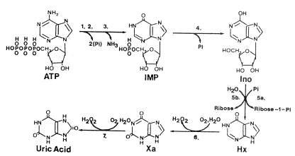  

上圖中各階段的酵素:
1. 腺苷三磷酸酶(ATP-ase)
2. 肌激酶(myokinase)
3. 腺苷單磷酸脫氨酶(AMP deaminase)
4. 肌苷單磷酸磷酸水解酶(IMP phosphohydrolase)
5. 5a 核苷磷酸酶(nucleoside phosphorylase)  
   5b 肌苷核苷酶(inosine nucleosidase)
6. 黃嘌呤氧化酶(xanthine oxidase)
7. 黃嘌呤氧化酶(xanthine oxidase)

又，5a的核苷磷酸酶為細菌性的，需要細菌的參與才會產生(變形桿菌)

詞彙說明:
- 雙磷酸腺苷(adenosine diphosphate; ADP)
- 單磷酸腺苷(adenosine monophosphate; AMP)
- 單磷酸肌苷(inosine monophosphate; IMP)
- 肌苷(inosine; Ino / HxR) 
- 次黃嘌呤 (hypoxanthine;Hx)  

每一種魚都會經歷上述的降解過程，只差在各反應(從A變B)的速率不同。一般而言，IMP產生HxR與Hx的反應較慢，故新鮮肉類會累積較多的IMP(鮮味來源)，而HxR與Hx含量增加時，表示鮮度下降。  
從反應式上看，可以看到Ino(HxR)與Hx都是較後端的產物，其中次黃嘌呤Hx 被認為對變壞的魚(spoiled fish)所感覺的苦的不良風味有直接的影響，且只有它會造成。  
而HxR只是中間產物，並沒有找到文獻說明HxR跟腐敗之間的直接關係。只能說因為時間上隨著IMP下降、HxR的增加，這意味著鮮度消失，因此可以用HxR(與Hx)的含量來判斷是否要進入腐敗期

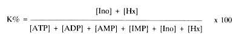  
K值愈大，表示鮮度愈差。
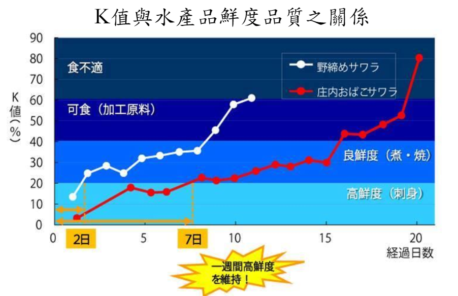  
註: 野締指的是魚在捕獲後，不加處理讓其自然死亡的方式

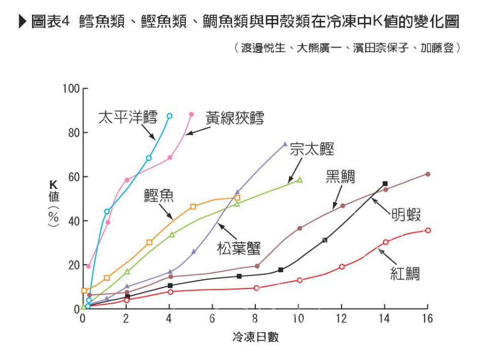 
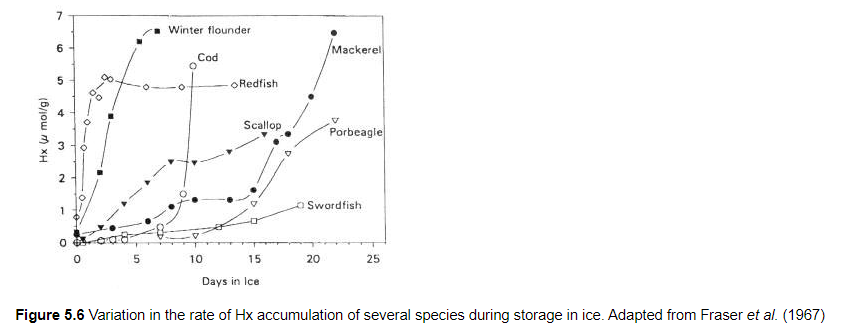 

而pH 值亦為鮮度檢測方法，一般活魚肌肉之pH為7.2~7.4，死後 因醣解作用使肌肉pH逐漸降低，達最低點後，隨著腐敗之進行鮮度降低致鹽基性物質上升(NH3、胺基化合物)， pH 再度上升。這一階段 pH 值的逐漸上升正好反映鮮度下降的程度，因而被採用作為鮮度判定的標準。故pH來判斷鮮度之原因即為此。  

pH由由最低點再上升至最低點再上升至6.2附近附近時，是為腐敗初期，所以魚類死亡前的掙扎增加乳酸時，是為腐敗初期，所以魚類死亡前的掙扎增加乳酸也會加速魚肉至腐敗階段。

除了化學上，物理上的影響也會改變魚隻自家消化的速度。
因為許多的自家消化酵素是被分隔存在於離散的膜結合組包(membrane-bound packages)中，當受到物理性傷害就破裂，導致酵素與基質充分混合，就會加速降解。
例如魚隻堆疊過密、卸貨的時候損傷魚體等。

在自家消化的階段快結束時，就換到細菌的生長了。這也是腐敗階段的開始。
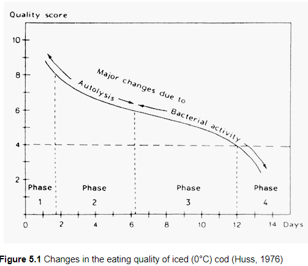 

#### 蛋白質分解
Q:上面闡述的都是ATP的分解，那蛋白質對鮮度的影響呢?

<補充>
受內源性酵素(組織蛋白酶)降解蛋白質的自家消化和微生物的蛋白酶作用，為細菌生長創造了有利的環境及食品感官性質的改變，即使冷藏和冷凍貯藏，水產物的自家消化仍以緩慢的速率進行。

##### 組織蛋白酶
魚組織中已發現數種蛋白質分解酵素(proteolytic enzymes)，最常被提的就是組織蛋白酶(cathepsins)。

組織蛋白酶屬酸性蛋白酶，通常存在於溶菌體(lysozomes)，在活的組織中，認為溶菌體蛋白酶是負責受傷部位處的蛋白質分解，因而組織蛋白酶在活的組織的大多數部位都是無活性的，當僵直後肌肉受到物理損傷或被凍結與解凍，酵素就被釋出進入細胞液中。

有趣的是在所有舉例，以測定組織蛋白酶L活性代表自家消化能力(autolytic ability)時，在冷凍/解凍組織所測得的數值都高於生鮮組織。凍結與解凍常會打破細胞膜，而使自家消化的膜結合型酵素可和其天然的基質反應。(所謂的凍熟法??)

##### 鈣蛋白酶
細胞內蛋白酶的第二群稱為鈣蛋白酶(calpains)或鈣活化因子(calcium activated factor; CAF)，近年來也瞭解和魚類肌肉的自家消化有關連。  

##### 膠原蛋白酶
硬骨魚的肌肉被稱為肌隔(myocommata)之結締組織所分隔，而分成「肉片flakes」或肌節(myotomes)的肌肉細胞塊(blocks of muscle cells)，每個肌肉細胞或纖維被結締組織包圍，結締組織藉著細膠原蛋白纖維(thin collagenous fibrils)連接細胞尾端的肌隔。

膠原蛋白酶的酵素作用，可溶解這些膠原蛋白纖維

<整理>
| 酵素                                  | 基質              | 遭遇的變化                                        |
| ----------------------------------- | --------------- | -------------------------------------------- |
| 醣解酵素(glycolytic enzymes)            | 肝醣              | 乳酸產生，組織pH降低， 肌肉的保水力降低；溫度高時，硬直會造成龜裂(gaping)
| 自家消化酵素(autolytic enzymes)，涉及核苷酸的降解) | ATP、ADP、AMP、IMP | 新鮮魚風味消失，次黃嘌呤的苦味逐漸產生(後期階段)                    |
| 組織蛋白酶(cathepsins)                   | 蛋白質、胜肽          | 組織軟化而無法或不易加工處理                               |
| 鈣蛋白酶(calpain)                       | 肌原纖維蛋白質         | 軟化、甲殼類之脫殼誘導的軟化                               |
| 膠原蛋白酶(collagenases)                 | 結締組織            | 肉片龜裂(gaping)、軟化                              |

#### 細菌分解
為何活體不會腐敗? 主要是因為免疫系統與新陳代謝的作用。  
自家消化過程開始進入到「微生物大軍現身」階段，因為免疫系統在死後隨之停擺，微生物便開始蓬勃發展。簡單來說，自家消化會透過提供更好的成長環境而加速腐敗微生物的生長。  

##### 活魚的菌相
活魚與剛捕獲魚的外表全部(皮與腮)和腸道都有微生物存在，但總數量變動很大。
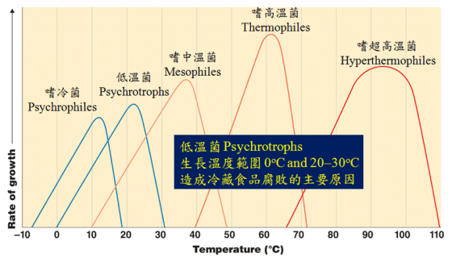  
[微生物的奇幻旅程：食物為何變得好壞壞？](https://pansci.asia/archives/122589)

日本學者的研究，顯示魚腸胃道中含有很高量的微生物，比周圍水域高出甚多，這表明腸胃道存在著對微生物有利的生態區位(niche)

##### 微生物的侵入
健康的活魚或剛捕獲的魚其肌肉是無菌的，此乃魚的免疫系統防止細菌在肌肉中生長。魚一旦死亡，免疫系統立即崩解，細菌因而得以自由增殖。  
在皮膚表面，很大程度上細菌定殖在鱗片袋(scale pockets ??)，貯存期間透過肌肉纖維之間的移動而侵入肌肉  
由於只是限量的微生物實際侵入肉中，微生物的生長主要仍在表面。若觀察到腐敗，可能在大程度上細菌的酵素已擴散進入肉中，以及營養素也擴散至外面而引起的後果。

魚類的腐敗速率差異很大，認為歸咎於魚體表面的性質的差異。  
- 表皮:  
  比目魚有強韌的真皮(dermis)與表皮(epidermis)，不容易腐敗；鱈魚的外皮很脆弱，因而腐敗快速  
- 黏液:  
  比目魚具有厚的黏液層，含抗菌性組成分與溶菌酵素

##### 貯藏及腐敗期間微生物菌群的變化∕特定的腐敗微生物
從溫帶水域所捕獲之魚體上的細菌，幾乎在魚死亡後就立即進入對數成長期，魚冰藏時也是如此，可能菌群已適應冰冷的溫度。在冰藏期間，細菌成長倍增的時間大約1天。

冰藏魚如果貯藏在厭氧條件下或充填二氧化碳的環境，與好氧環境下貯藏的魚比較，常態的嗜冷菌(psychrotrophic bacteria)譬如腐敗希瓦氏菌(S. putrefaciens)和假單孢菌屬(Pseudomonas)的數量通常低甚多

室溫(25°C)下，達腐敗時的菌相主要是嗜溫性弧菌科(mesophilic Vibrionaceae)占優

腐敗菌相(spoilage flora)和腐敗細菌(spoilage bacteria)兩項用語應明確區別。  
腐敗菌相僅描述當腐敗時的魚體上所存在的細菌，而腐敗細菌是指產生與腐敗有關的不良氣味與不良風味之特定菌群。  
存在於腐敗魚(spoiled fish)之細菌有一大部分都無關於腐敗，每種魚類產品有其自己特定的腐敗細菌。  
確定從腐敗魚分離的細菌之中是哪些細菌引起腐敗，並不是件簡單的工作，這需要感官的、微生物的與化學的等多方面的研究。(不同的魚，在不同溫度的保存下，會生長的腐敗菌並不相同)  

##### 貯藏與腐敗過程中細菌生長所誘發的生化變化
比較自然腐敗中的魚(naturally spoiling fish)和滅菌的魚(sterile fish)的化學成分變化，可看出大多數的揮發性化合物是細菌所產生的。  
這些化合物包括三甲胺、揮發性硫化合物、醛類、酮類、酯類、次黃嘌呤以及其它低分子量化合物。
比起從厭氧發酵，微生物可以從氧化取得更多的能量。這也是為何在充足氧氣下，腐敗較快速的原因。

##### 氧化三甲胺(TMAO)的還原
一般而言，魚體上特定的腐敗細菌中有許多在厭氧呼吸時，都能利用TMAO作為電子接受體，其所還原的三甲胺(TMA)，是腐敗中的魚的主要組成分之一，具有典型的魚腥味(fishy odour)。

TMAO的還原主要和海洋環境中典型的細菌屬有關。但氣單胞菌屬(Aeromonas)與腸道菌科(Enterobacteriaceae)也有關連。

腐敗希瓦氏菌在與TMAO有關的厭氧呼吸時，能利用各種碳源作為基質，包括甲酸鹽及乳酸鹽。而當TMAO是電子傳遞鏈的最終接收者時，有氧呼吸會利用到的醋酸鹽及琥珀酸鹽等化合物則不會參與反應。

在許多魚種中，細菌分解時可同時產生TMA和次黃嘌呤 (hypoxanthine;Hx)，而且通常在這個階段由細菌生成的速率大於自家分解的速率。

揮發性硫化合物是魚腐敗中常見的組成分，屬特定腐敗細菌的大部分細菌都會產生一種或數種揮發性硫化物。揮發性含硫化合物非常難聞，可偵測至ppb (十億分之一)程度，因此即使最小量也明顯影響於品質。

冷藏時的腐敗來自於腐敗希瓦氏菌，室溫時的腐敗來自弧菌科，兩者皆導致大量的硫化氫(H2S)及TMA。由假單胞菌屬引起的腐敗特徵就欠缺這些的化合物。若冷藏魚受假單胞菌屬的腐敗，典型的氣味為水果味(fruity)、腐敗的(rotten)及硫化物(sulphydryl)般的氣味與風味。

##### 常見的腐敗化合物

| 特定的腐敗生物                       | 典型的腐敗化合物                                 |
|--------------------------------------|--------------------------------------------------|
| 腐敗希瓦氏菌Shewanella putrefaciens  | 三甲胺、硫化氫、甲基硫醇、二甲基硫化物、次黃嘌呤 |
| 磷光發光菌Photobacterium phosphoreum | 三甲胺、次黃嘌呤                                 |
| 假單胞桿菌屬Pseudomonas spp.         | 酮類、醛類、酯類、硫化氫以外的硫化物             |
| 弧菌科Vibrionaceae                   | 三甲胺、硫化氫                                   |
| 嫌氣性腐敗菌(anaerobic spoilers)     | 氨、醋酸、丁酸及丙酸                             |

##### 常見的不良氣味/不良風味化合物與其基質

| 基質                           | 細菌作用產生的化合物   |
|--------------------------------|------------------------|
| 氧化三甲胺                     | 三甲胺(TMA)            |
| 半胱胺酸                       | 硫化氫                 |
| 甲硫胺酸                       | 甲基硫醇、二甲基硫化物 |
| 碳水化合物和乳酸               | 醋酸、二氧化碳、水     |
| 肌苷、肌苷酸                   | 次黃嘌呤               |
| 胺基酸(甘胺酸、絲胺酸、白胺酸) | 酯類、酮類、醛類       |
| 胺基酸、尿素                   | 氨                     |

#### 脂質降解

## Food Science
### Flavor
#### Umami

### Smell
#### Bad Smell
魚腥味: 三甲基胺或稱三甲胺(Trimethylamine, TMA)是形成魚腥臭的原因，新鮮的魚含量少，是藉由氧化三甲胺(Trimethylamine oxide, TMAO)還原而來的。淡水魚的TMAO少，或不含，故淡水魚的魚臭主體是六氫吡啶(piperidine)，而非三甲基胺。  
鯊魚類肌肉中含有多量TMAO，同時有尿素分解而生成氨，更加強其臭味。

Q: 為何死後會大量出水?
Q: 何謂退酸?
Q: 為何酵素性分解比細菌性分解早開始?